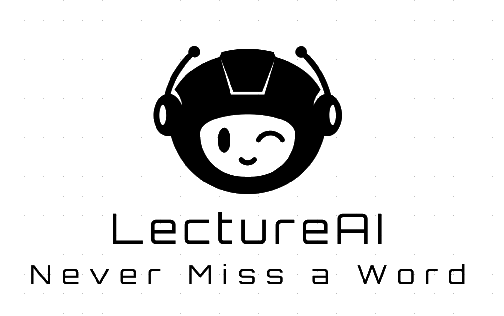

<div align="center">
  

  # LectureAI

  **AI-powered lecture notes in minutes — so students can focus on understanding, not note-taking.**

  [](https://www.python.org/)
  [](https://fastapi.tiangolo.com/)
  [](https://deepmind.google/technologies/gemini/)
  [](https://openai.com/research/whisper)
  [](LICENSE)
</div>

---

## The Problem

We surveyed 500+ NUS students and found a consistent, painful pattern:

- **72%** rewatch lecture recordings because they missed key insights the first time
- **230+** students prefer study materials in Mandarin — materials that largely don't exist
- Current tools — Zoom auto-captions, Otter.ai — fail on the accents and technical vocabulary common in NUS lectures, producing walls of unstructured, error-filled text
- ChatGPT can help, but requires a student to manually transcribe, copy, and prompt — 30+ minutes of work per lecture, per student, every week
- Students are spending hours rewriting notes instead of spending that time learning

The recordings exist. The content is there. The bottleneck is the pipeline that turns a 90-minute lecture into something students can actually use.

---

## What LectureAI Does

LectureAI is an end-to-end pipeline that ingests a lecture audio file and optional lecture slides, and produces structured bilingual study notes — automatically, in under 15 minutes, for less than $1.

Upload a recording. Get back a formatted `.docx` with topic-wise notes, key concept definitions, extracted deadlines, and a full Mandarin translation — plus `.srt`/`.vtt` caption files ready for Panopto or any LMS.

**Features:**

- 🎙️ **Whisper-powered transcription** — handles accented English and technical vocabulary better than any caption tool built into a video platform
- 🔍 **Slide-context correction (RAG)** — lecture slides are injected as context so the AI can fix "LS TM" → "LSTM" and "reoccurrent" → "recurrent" before summarisation
- 📋 **Topic-wise structured notes** — 4–10 topics per lecture, each with summary bullets, key concept definitions, and formula references; not a transcript reformat
- 🌐 **Bilingual output (EN + ZH)** — full Mandarin translation with technical terms preserved in English so meaning is never lost in translation
- ✅ **Automatic action item extraction** — deadlines, assignments, and announcements pulled out with urgency labels
- 📄 **Caption export** — `.srt` and `.vtt` files compatible with Panopto, Canvas, and standard LMS platforms
- 📧 **Email delivery** — notes sent directly to a configured inbox; no login, no dashboard friction
- 🖥️ **Clean web interface** — drag-and-drop upload, live progress tracking, one-click download

---

## Demo

> Demo video coming soon.

**Sample output:** See [`sample_output/neural_networks_lecture.md`](sample_output/neural_networks_lecture.md) — the actual structured notes generated from a 101-minute NUS lecture on Neural Networks on Sequential Data, including all 7 topics, key concepts, and extracted action items.

---

## Quick Start

### Prerequisites

- Python 3.10+
- `ffmpeg` installed and on your PATH (`brew install ffmpeg` on macOS)
- OpenAI API key (for Whisper transcription)
- Google AI API key (for Gemini 2.0 Flash — free tier works)
- A Gmail account with an App Password (for email delivery)

### Setup

```bash
# 1. Clone the repository
git clone https://github.com/arshinsikka/lectureai-mvp.git
cd lectureai-mvp

# 2. Create and activate a virtual environment
python3.10 -m venv .venv
source .venv/bin/activate       # Windows: .venv\Scripts\activate

# 3. Install dependencies
pip install -r requirements.txt

# 4. Configure environment variables
cp .env.example .env
# Edit .env with your API keys and email credentials

# 5. Start the server
uvicorn app.main:app --reload
```

The API is now live at `http://localhost:8000`. Open `frontend/index.html` in your browser to use the web interface.

See [`.env.example`](.env.example) for a full description of every required variable.

---

## Architecture Overview

LectureAI is a sequential, checkpoint-based pipeline. Each step saves its output as a JSON file, which means any step can be re-run independently without reprocessing the entire lecture.

```
Upload → Preprocess (pydub) → Transcribe (Whisper API)
       → Parse Context (PyMuPDF / python-pptx)
       → Correct Transcript (Gemini 2.0 Flash + slide context)
       → Summarise (Gemini 2.0 Flash + slide context)
       → Extract Action Items (Gemini 2.0 Flash)
       → Translate EN→ZH (Gemini 2.0 Flash)
       → Generate .docx (python-docx)
       → Export Captions (.srt / .vtt)
       → Send Email (Gmail SMTP)
```

The two most important steps are **Correct** and **Summarise** — both receive the lecture slides as context, which is what separates LectureAI's output quality from a generic "paste transcript into ChatGPT" workflow.

For a detailed breakdown of every step, the data flow, the technology choices, and the tradeoffs, see [**docs/architecture.md**](docs/architecture.md).

---

## Cost Analysis

For a typical 60-minute lecture:

| Step | Service | Cost |
|---|---|---|
| Transcription | OpenAI Whisper API ($0.006/min) | ~$0.36 |
| Correction | Gemini 2.0 Flash (free tier) | $0.00 |
| Summarisation | Gemini 2.0 Flash (free tier) | $0.00 |
| Translation | Gemini 2.0 Flash (free tier) | $0.00 |
| Action Items | Gemini 2.0 Flash (free tier) | $0.00 |
| **Total** | | **< $0.40** |

At NUS scale — roughly 10,000 lectures per semester across all faculties — full bilingual structured notes for every lecture would cost under $4,000 per semester. That's less than a couple of part-time TA's salaries, delivering value to every student in every course.

---

## Roadmap

| Phase | Status | Description |
|---|---|---|
| **Phase 1** | ✅ Complete | MVP: manual upload, bilingual notes, email delivery, caption export |
| **Phase 2** | Planned | Zoom OAuth integration, Panopto caption push via API |
| **Phase 3** | Planned | Student dashboard, per-course folders, searchable notes history |
| **Phase 4** | Planned | LMS integration (Canvas/IVLE), quiz and flashcard generation |
| **Phase 5** | Planned | Multi-language support (Tamil, Bahasa, Malay), speaker diarisation |

---

## API Reference

| Method | Endpoint | Description |
|---|---|---|
| `GET` | `/api/ping` | Health check |
| `POST` | `/api/upload` | Upload audio + optional context files; returns `session_id` |
| `POST` | `/api/process/{session_id}` | Start full pipeline in background |
| `GET` | `/api/status/{session_id}` | Poll pipeline progress (0–100%) |
| `GET` | `/api/results/{session_id}` | Retrieve notes preview + download URLs |
| `GET` | `/api/download/{session_id}/{filename}` | Download `.docx`, `.srt`, or `.vtt` |

Full request/response schemas: [**docs/api.md**](docs/api.md) *(coming soon)*

---

## Team

Built at NUS as part of the **NUS Enterprise BLOCK71** incubator program.

- Website: [lectureai.co](https://lectureai.co)
- Contact: [teamlectureai@gmail.com](mailto:teamlectureai@gmail.com)
- GitHub: [github.com/arshinsikka](https://github.com/arshinsikka)

---

## License

[MIT](LICENSE) — free to use, fork, and build on.
