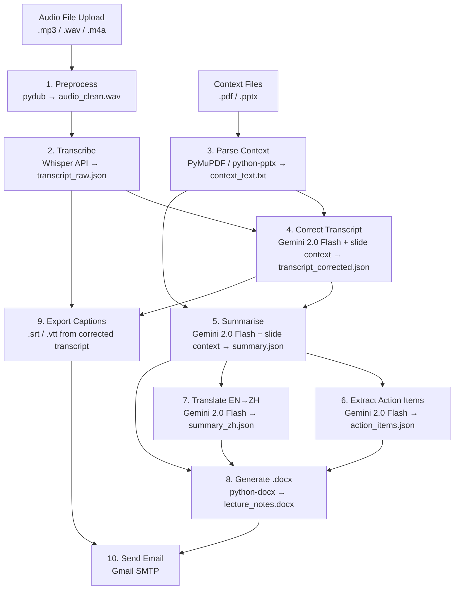

# System Architecture — How LectureAI Works

This document is the technical deep-dive. It explains not just *what* each component does, but *why* it exists in the pipeline and the specific tradeoffs behind every major decision. If you're evaluating LectureAI's design or extending it, start here.

---

## Design Philosophy

**Modular and independently testable.** Each pipeline step is a separate Python module with a well-defined input/output contract. Correction doesn't know about summarisation. Translation doesn't know about transcription. This makes it straightforward to swap out any component — replace Gemini with GPT-4o, or Whisper with a self-hosted model — without touching anything else.

**File-based checkpointing.** Every intermediate result is written to disk as a JSON file before the next step begins. If the pipeline fails at step 7 (translation), a retry resumes from step 7 — not from step 1. This is critical for a pipeline that calls expensive external APIs; it prevents double-billing and makes debugging fast.

**Context-aware AI.** Lecture slides are parsed and injected as context into both the correction and summarisation prompts. This is the architectural decision that most directly improves output quality. A generic LLM has no idea what "LSTM" means in the context of a specific NUS lecture; a slide that says "Long Short-Term Memory (LSTM)" on it provides that ground truth.

**Graceful degradation.** The pipeline is designed to produce *some* output even when components fail. No slides? Correction and summarisation still run, just without context. Translation fails? English-only notes are still delivered. Email fails? The session files remain downloadable. No single failure kills the whole pipeline.

---

## Pipeline Architecture



---

## Pipeline Deep Dive

### Step 1: Audio Preprocessing

**What and why:** Raw lecture audio arrives in whatever format the recording system produced — MP3, WAV, M4A, FLAC, OGG, WEBM. Whisper performs best on 16kHz mono WAV. Preprocessing normalises the audio to a consistent format before it ever reaches the API, which prevents obscure Whisper errors and ensures consistent transcription quality across different recording setups.

**Implementation:** `app/services/audio.py` uses `pydub` to convert and resample.

**Input:** `data/{session_id}/{original_filename}`
**Output:** `data/{session_id}/audio_clean.wav` (16kHz, mono, WAV)

**Edge cases handled:** Stereo → mono downmix, non-standard sample rates, files that are already WAV (passthrough).

---

### Step 2: Transcription

**What and why:** The core conversion from audio to text. Whisper API is called with the cleaned WAV file to produce timestamped word-level transcription segments.

**Implementation:** `app/services/transcription.py` calls `openai.audio.transcriptions.create()` with `response_format="verbose_json"` to get timestamps alongside text.

**Input:** `data/{session_id}/audio_clean.wav`
**Output:** `data/{session_id}/transcript_raw.json`

```json
{
  "segments": [
    {
      "id": 0,
      "start": 0.0,
      "end": 4.2,
      "text": "Welcome back everyone, today we're continuing with recurrent networks..."
    }
  ],
  "language": "en",
  "duration": 6047.3
}
```

**Why Whisper API over self-hosted:** Running Whisper locally requires a GPU. Setting up a GPU instance, container, and inference server adds weeks of DevOps work at MVP stage. The API costs $0.006/minute — a 60-minute lecture is $0.36. The economics are clear at this scale: buy the API call, not the infrastructure.

**Edge cases handled:** Files longer than the Whisper API's 25MB limit are split into overlapping chunks with `pydub`, transcribed separately, and re-joined with overlap de-duplication to prevent cut-off sentences.

---

### Step 3: Context Parsing

**What and why:** Lecture slides contain the ground truth for terminology, names, formulas, and topic structure. Extracting this text and making it available to downstream steps is the foundation of LectureAI's quality advantage.

**Implementation:** `app/services/context_parser.py` uses `PyMuPDF` (fitz) for PDFs and `python-pptx` for PPTX files. Text is extracted per-slide, cleaned of rendering artifacts, and concatenated.

**Input:** `data/{session_id}/context/` (zero or more PDF/PPTX files)
**Output:** `data/{session_id}/context_text.txt` (plain text, one block per slide)

**Why no vector database:** Lecture slides are small — typically 30–80 slides with sparse text. The full extracted text for an entire lecture is well within Gemini 2.0 Flash's 1M-token context window. Adding FAISS or Pinecone at this stage would introduce infrastructure complexity (index management, embedding costs, update latency) with no quality benefit. We'd revisit this if the context source grew to include entire course syllabuses, textbook chapters, or past exam papers.

---

### Step 4: Transcript Correction

**What and why:** Whisper is extremely good, but it makes systematic errors on accented speech and technical vocabulary. "LSTM" becomes "LS TM". "Backpropagation" becomes "back propagation". "Softmax" becomes "soft max". These errors cascade — a summarisation model working on corrupted text will produce corrupted notes. Correction with slide context fixes these *before* they propagate.

**Implementation:** `app/services/correction.py` calls Gemini 2.0 Flash via `app/services/gemini_helper.py`. The raw transcript is processed in 3000-word overlapping chunks to handle context window limits while preserving sentence continuity across chunk boundaries. The prompt (`app/prompts/correction.txt`) instructs the model to fix only technical errors using the slide text as reference, preserving all content and speaker rhythm.

**Input:** `transcript_raw.json` + `context_text.txt`
**Output:** `data/{session_id}/transcript_corrected.json` (same schema as raw)

**Retry logic:** The shared `call_gemini()` wrapper in `gemini_helper.py` handles 429 rate-limit responses with a 60-second wait (or the API-suggested delay) and retries up to 3 times. Other errors get one retry after 5 seconds.

**Edge cases handled:** Lectures without slides (correction runs as grammar/punctuation cleanup only), segments that are already correct (model instructed not to change them), timestamp preservation (corrected text maps back to original timestamps for caption export).

---

### Step 5: Summarisation

**What and why:** Students don't need 12,000 words of corrected transcript — they need 500 words of structured notes that mirror how the lecturer actually organised the material. This step transforms the corrected transcript into topic-wise notes.

**Implementation:** `app/services/summarisation.py` sends the full corrected transcript plus slide context to Gemini 2.0 Flash with the prompt at `app/prompts/summarisation.txt`. The model is instructed to identify 4–10 natural topic boundaries (based on the slide structure and content transitions), and for each topic produce:
- A descriptive heading
- 4–6 concrete bullet points with specifics (names, numbers, formulas)
- Key concept definitions (technical terms with one-sentence explanations)
- Plain-text formula references

**Input:** `transcript_corrected.json` + `context_text.txt`
**Output:** `data/{session_id}/summary.json`

```json
{
  "lecture_title": "Neural Networks on Sequential Data",
  "topics": [
    {
      "heading": "Motivation for Sequential Models",
      "summary": ["...", "..."],
      "key_concepts": [
        {"term": "sequential data", "definition": "..."}
      ],
      "formulas": ["h_t = tanh(W_h * h_{t-1} + W_x * x_t + b)"]
    }
  ]
}
```

---

### Step 6: Action Item Extraction

**What and why:** Lectures frequently contain deadline reminders, assignment announcements, and administrative notices embedded mid-lecture. Students miss these. This step extracts them explicitly so they appear at the top of the notes document.

**Implementation:** `app/services/action_items.py` passes the corrected transcript to Gemini 2.0 Flash with a prompt focused on identifying time-sensitive information. Each action item is classified by urgency (high/medium/low).

**Input:** `transcript_corrected.json`
**Output:** `data/{session_id}/action_items.json`

```json
{
  "action_items": [
    {
      "description": "PS40 problem set due next Friday",
      "urgency": "high",
      "context": "mentioned at 00:08:43"
    }
  ]
}
```

---

### Step 7: Translation (EN → ZH)

**What and why:** 230+ surveyed NUS students indicated a preference for study materials in Mandarin. No existing lecture tool provides automatic bilingual academic notes. Translation is applied to the structured `summary.json` — not the raw transcript — which means students get structured, topic-organised Mandarin notes, not a wall of translated text.

**Implementation:** `app/services/translation.py` sends the full `summary.json` to Gemini 2.0 Flash with the prompt at `app/prompts/translation.txt`. The prompt instructs the model to translate text fields only (headings, bullets, definitions) while preserving JSON structure and keeping model names, acronyms, and mathematical notation in English.

**Input:** `summary.json`
**Output:** `data/{session_id}/summary_zh.json` (same schema, translated values)

**Technical term preservation:** LSTM, RNN, Transformer, BERT, GPT — all remain in English in the Chinese output. For established Chinese CS terms, the convention is `循环神经网络 (RNN)` on first use, then `RNN` thereafter. This is the convention used in mainland China university textbooks, which is the academic register most NUS Chinese-speaking students are familiar with.

---

### Step 8: Document Generation

**What and why:** The structured data needs to be in a format students can actually use and submit. `.docx` is the standard for academic use — compatible with Microsoft Word, Google Docs, and every LMS submission portal.

**Implementation:** `app/services/doc_generator.py` uses `python-docx` to build a formatted Word document. The document structure: action items table at the top, then English topics, then a section divider, then Mandarin topics. Headings, bullets, and concept definitions use Word's built-in styles for clean formatting.

**Input:** `summary.json` + `summary_zh.json` + `action_items.json`
**Output:** `outputs/{session_id}/lecture_notes.docx`

---

### Step 9: Caption Export

**What and why:** Universities increasingly mandate that lecture recordings have accurate captions for accessibility. The `.srt` and `.vtt` formats are the standard for Panopto, Canvas, and YouTube. By generating captions from the *corrected* transcript (not the raw Whisper output), LectureAI produces captions that are meaningfully better than what recording platforms auto-generate.

**Implementation:** `app/services/caption_export.py` converts the timestamped segments from `transcript_corrected.json` into SRT and VTT format.

**Input:** `transcript_corrected.json`
**Output:** `outputs/{session_id}/captions.srt`, `outputs/{session_id}/captions.vtt`

---

### Step 10: Email Delivery

**What and why:** At MVP stage, the lowest-friction delivery mechanism for notes is email. No student account required, no app to install, no dashboard to log into. Notes arrive in their inbox within 15 minutes of lecture upload.

**Implementation:** `app/services/email_sender.py` uses Gmail SMTP with TLS. The `.docx`, `.srt`, and `.vtt` files are attached. If email delivery fails, the pipeline completes successfully and the files remain available via the download API. Email failure does not abort the pipeline.

---

## The Two-Step LLM Architecture

The most important architectural decision in LectureAI is separating transcript correction (Step 4) from summarisation (Step 5) into two distinct LLM calls.

**Why not do it in one step?**

A single prompt asking an LLM to "fix this transcript and then summarise it into topics" would save one API call. We chose not to do this for three reasons:

1. **Error cascading prevention.** Whisper errors in technical vocabulary (wrong model names, garbled formulas) would propagate directly into the summary. By correcting first, summarisation always works on clean text.

2. **Independent quality measurement.** We can evaluate correction quality (WER improvement) separately from summarisation quality (topic accuracy). A single-step approach makes it impossible to know which step is responsible for an output error.

3. **Output reuse.** The corrected transcript is used in *two* downstream steps: summarisation (Step 5) *and* caption export (Step 9). The correction output is therefore not wasted computation — it's shared. A one-step approach would produce a summary but no corrected transcript for captions.

---

## RAG Without a Vector Database

LectureAI implements retrieval-augmented generation the simplest possible way: extract slide text, put it in the prompt, let the LLM use it.

**Why this works at MVP scale:** A typical 60-slide lecture deck with moderate text density extracts to roughly 3,000–6,000 tokens. Gemini 2.0 Flash's 1M-token context window comfortably fits the full slide text alongside a 12,000-word transcript. There is no need for semantic search, chunking, or indexing.

**When we'd add a vector database:** At the scale of a full university — multiple document types (syllabuses, textbook chapters, past exam papers, course notes) per course, hundreds of courses — the context would exceed what fits in a single prompt. At that point, a FAISS or Pinecone index with per-query retrieval would be the right architectural upgrade. For an MVP validating the core value proposition, that complexity is premature.

---

## Infrastructure Decisions

| Decision | Choice | Alternative Considered | Reason |
|---|---|---|---|
| Task queue | FastAPI `BackgroundTasks` | Celery + Redis | Zero setup for MVP; sufficient for low concurrency |
| State storage | JSON files on disk | PostgreSQL / SQLite | No database setup, human-readable for debugging |
| Transcription | OpenAI Whisper API | Self-hosted Whisper (GPU) | $0.36/lecture vs weeks of GPU infrastructure setup |
| Summarisation | Gemini 2.0 Flash | GPT-4o | Free tier, 1M context window, strong academic accuracy |
| Email | Gmail SMTP | SendGrid | No vendor account or API key setup for early testers |
| Slide parsing | PyMuPDF + python-pptx | Unstructured.io | Zero external dependencies, sufficient for structured slides |

Every one of these decisions optimises for **validated learning speed over production hardening**. The architecture is designed to be upgraded at each point as the product scales, not locked in.
